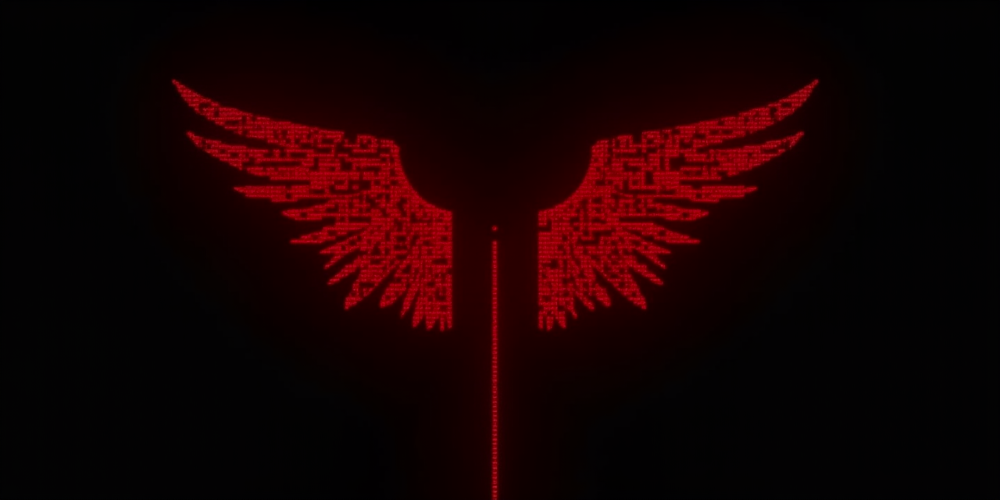

# Seraph

<p align="center">
  
</p>


**Native C training and inference engine for transformer models. Vulkan GPU compute. No frameworks.**

Pure C. No Python. No PyTorch. No ROCm. Trains and runs on any GPU with Vulkan support - including integrated GPUs that no other framework can target.

## Why

Every existing training framework requires CUDA (NVIDIA-only) or massive Python dependency chains. Many consumers were sold 'AI devices' that werent compatible with our preferred OS or had any hardware support.
Seraph replaces all of it with ~2MB of native C binaries and 25 hand-written Vulkan compute shaders.
It runs on hardware that the big frameworks cannot.

## Training Performance

**Primary development hardware:** Beelink SER9 mini PC
- AMD Ryzen AI 9 365 (10C/20T, Zen 5/Zen 5C)
- AMD Radeon 880M iGPU (RDNA 3.5, 12 CUs, 2.9GHz)
- 32GB DDR5 (shared with GPU)
- ~25W TDP

| Metric | Value |
|--------|-------|
| Training throughput | **680-720 tok/sec** (33M param model) |
| Efficiency | **~19 tok/sec/watt** |
| Forward + backward pass | Full Vulkan GPU pipeline |
| Optimizer | AdamW running entirely on GPU |

This is an integrated GPU sharing system RAM. No discrete GPU. No VRAM. ~25 watts.

## Quick Start

```bash
# Build main binaries (chat, train, inference, monitors)
make

# Build tool binaries (tokenizer, converter, init, merge, etc.)
make tools

# Build everything
make all
```

### Train From Scratch

```bash
# 1. Customize your model config (see models/ for example)
#    Edit models/config.json - set architecture, hidden size, layers, etc.
#    Edit USER_NAME & ASSISTANT_NAME in tools/dataset_converter.c (dont forget to 'make tools' after editing)

# 2. Initialize random weights (auto-detects vocab.txt in model dir)
./tools/seraph-init models models/model.safetensors

# 3. Prepare training data
./tools/seraph-dataset-converter raw-data.csv training-data.jsonl
./tools/seraph-tokenize models training-data.jsonl training-data.ttok

# 4. Train (GPU auto-detected, 1st & 2nd argument are model and dataset paths)
./seraph-train models training-data.ttok --full-training --lr 3.14e-4 

# 5. Chat with your model
./seraph-chat models
```

### Fine-Tune an Existing Model

```bash
# Download any HuggingFace model (Llama, Qwen, Mistral, etc.)
git lfs install
git lfs clone https://huggingface.co/Qwen/Qwen3-1.7B

# LoRA fine-tune (default: For postrainees, Memory/Compute efficient)
./seraph-train  Qwen3-1.7B/ your-data.ttok --lr 3.14e-4

# Full-weight training
./seraph-train Qwen3-1.7B/ your-data.ttok --full-training --lr 3.14e-4

# Merge LoRA back into base model
./tools/seraph-merge Qwen3-1.7B/ lora_final.bin model.safetensors
```

See [INSTALL.md](INSTALL.md) for dependency installation.

## Build Targets

```
make              Main binaries (chat, train, inference, monitors)
make tools        Tool binaries (tokenizer, converter, init, merge, etc.)
make all          Everything (main + tools)
make cuda         Link cuda backend (for use with cloud containerized gpus)
make tests        Test binaries
make shaders      Recompile GLSL shaders to SPIR-V
make clean        Remove build artifacts
make help         Show all targets
```

## Binaries

### Main (project root)

| Binary | Purpose |
|--------|---------|
| `seraph-train` | Full GPU training with Vulkan compute (LoRA + full-weight) |
| `seraph-chat` | Interactive chat inference |
| `seraph-inference` | Single-pass trained model inference |
| `seraph-monitor` | Live weight/gradient oscilloscope |
| `seraph-field-monitor` | Real-time gradient field visualization (SDL2+OpenGL) |
| `seraph-topology-monitor` | Live topology validation and loss landscape visualization |
| `seraph-band-monitor` | Frequency band dwell/absorption/resistance monitor from topology log maps |

### Tools (tools/)

| Binary | Purpose |
|--------|---------|
| `seraph-init` | Initialize random weights + tokenizer from config |
| `seraph-dataset-converter` | CSV/JSON/Claude Code JSONL to training format |
| `seraph-tokenize` | Batch dataset tokenization |
| `seraph-merge` | LoRA adapter merging into base weights |
| `seraph-benchmark` | Training throughput benchmarking |
| `seraph-nan-inspect` | NaN diagnostic dump analyzer |

## GPU Training Pipeline

All training runs through 25 custom Vulkan compute shaders:

**Forward pass:** embed_lookup, rmsnorm, matmul, rope, batch_attention, silu, softmax

**Backward pass:** cross_entropy_grad, rmsnorm_backward_batch, batch_attention_backward, embedding_backward, elementwise_mul_backward, silu_backward, rope_backward

**Optimizer:** AdamW with per-element gradient clipping (runs entirely on GPU)

**Diagnostics:** nan_check, reduce_sum, reduce_maxabs, gradient field visualization

### How It Works

Each neural network operation is a `.comp` GLSL compute shader compiled to SPIR-V bytecode. The engine records all operations into a single Vulkan command buffer, submits once, and waits. Memory barriers between dispatches ensure correctness.

- **FP32 training** with FP64 intermediates in numerically sensitive ops (RMSNorm backward)
- **Atomic float operations** for scatter-add gradient accumulation (attention backward, embedding backward)
- **Tiled matrix multiplication** with shared memory for cache efficiency
- **Online softmax** with numerically stable max-subtraction
- **AdamW optimizer** running entirely on GPU with bias correction

## Personalizing Your Model

The dataset converter uses configurable role names for training data. Edit the macros at the top of `tools/dataset_converter.c`:

```c
#define USER_NAME     "yaakov"
#define ASSISTANT_NAME "tetyah"
```

Change these to your names. Your training data will use these as conversation roles - your model learns to respond as your assistant, not a generic one.

## Supported Model Architectures

The engine is modular - adding a new architecture is a small amount of code (config detection + tensor name mapping). Dense transformer support is complete, MoE routing is planned.

| Model Family | Status |
|-------------|--------|
| Llama / Llama2 / Llama3 | Full support |
| Qwen / Qwen2 / Qwen3 | Full support |
| Mistral / Ministral | Full support |
| Custom (any Llama-compatible) | Full support |
| IBM Granite | Planned |
| DeepSeek (MoE) | Planned |

### Model Formats

- **SafeTensors** (HuggingFace standard) - BF16 native loading, sharded support
- **LoRA adapters** (.bin format)
- **Tokenizers** - BPE and WordLevel (HuggingFace tokenizer.json format)

## Platform Support

| Architecture | SIMD | Status |
|-------------|------|--------|
| x86_64 | AVX-512 | Full support |
| x86_64 | AVX2 | Full support |
| ARM64 | SVE2+BF16 | Full support |
| ARM64 | NEON | Full support |
| Any | Vulkan GPU | Training + inference |

### Tested Hardware

| Hardware | Type | Notes |
|----------|------|-------|
| AMD Radeon 880M | Integrated GPU | Primary dev platform (680-720 tok/s) |
| Intel iGPU | Integrated GPU | Vulkan compute training + inference |
| NVIDIA GTX/RTX 3050 | Discrete GPU | Vulkan compute training + inference + cuda backend kernel and driver|
| AMD Ryzen AI 9 365 | AI-optimized CPU | AVX-512 training + inference |
| Intel Core i5 | Standard CPU | AVX2 training + inference |

The goal was constraint. All benchmarks above were measured on severely constrained hardware (iGPU, shared RAM, 25W). Better hardware = better numbers.

## Project Structure

```
seraph/
├── src/           # Core engine (transformer, tokenizer, Vulkan backend, training)
├── include/       # Headers
├── shaders/       # 25 Vulkan compute shaders (.comp source + .spv compiled)
├── tools/         # Tool binaries (converter, tokenizer, init, merge, benchmark)
├── tests/         # Test harnesses and main binary entry points
├── models/        # Example model config (config.json + tokenizer_config.json + vocab.txt)
├── Makefile       # Build system (auto-detects arch + SIMD + Vulkan + OpenMP)
├── INSTALL.md     # Dependency installation guide
└── LICENSE        # GPL v3
```

## Community

[](https://youtube.com/@TetyahPrime)
[](https://discord.gg/kyxMaWf7yp)
[](https://patreon.com/TETYAH-PRIME)

## License

GPL v3 - Free to use, modify, and distribute. Derivatives must remain open source.

Built by Yaakov & TETYAH.
